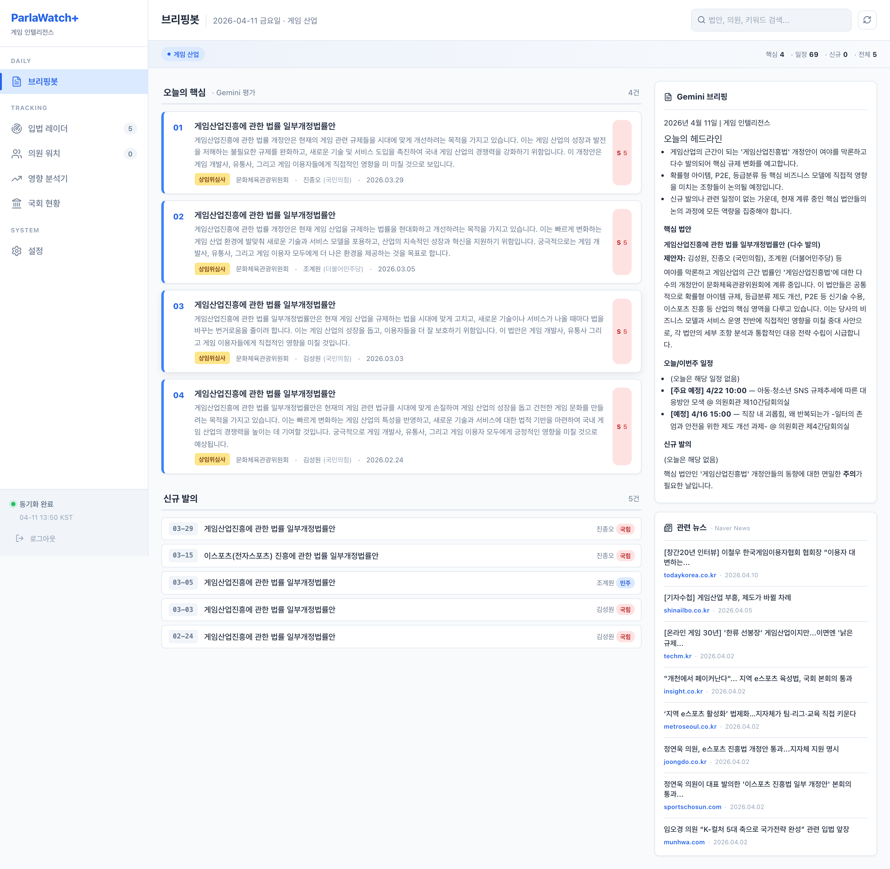
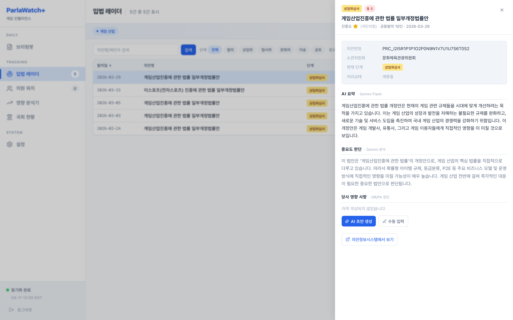
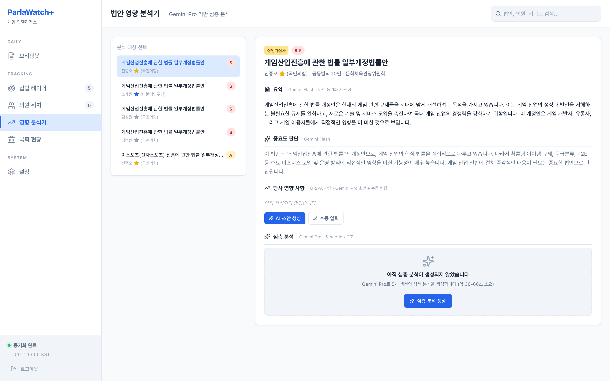
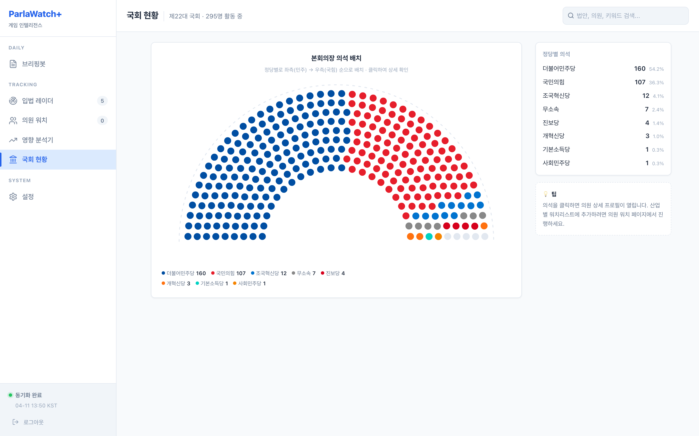

# ParlaWatch+

**산업별 국회 인텔리전스 대시보드** — 국회에 올라오는 법안을 산업별
키워드로 필터링하고, Gemini로 영향도를 평가하고, 매일 아침 GR/PA
담당자에게 필요한 브리핑을 만들어주는 내부용 대시보드.

## 라이브 데모

| | URL | 설명 |
|---|---|---|
| **데모** | [assembly-intelligence.vercel.app/demo/](https://assembly-intelligence.vercel.app/demo/) | 정적 스냅샷, 인증 불필요, 10개 탭 |
| **실앱** | [assembly-intelligence.vercel.app](https://assembly-intelligence.vercel.app/) | 실제 DB + Gemini, 비밀번호 필요 |

데모는 상단 탭으로 브리핑봇 → 입법 레이더 → 슬라이드오버 → 영향 분석기 →
의원 워치 → 국회 현황 → 설정 → 설정 위저드 → 로그인까지 전부 넘겨볼
수 있습니다 (실제 Gemini/Naver 출력 그대로). 편집·필터 제출 등
서버 인터랙션은 동작하지 않습니다.

실앱 접속 비밀번호는 관리자에게 문의하세요.

> GitHub Pages 미러: [kipeum86.github.io/assembly-intelligence/](https://kipeum86.github.io/assembly-intelligence/)
>
> 오프라인 공유: [`examples/app.html`](./examples/app.html) 파일 하나만 보내면 됩니다.

## 스크린샷

### 브리핑봇 — 매일 아침의 출발점



왼쪽은 Gemini가 점수 매긴 핵심 법안 카드 (게임산업진흥법 4건 모두
S 5점)이고, 제안자 이름 옆에는 산업 기준 의원 중요도 별표(S/A/B)가
붙습니다. 오른쪽은 Gemini Pro가 쓴 일일 브리핑 HTML과 Naver News에서
가져온 법안 관련 뉴스이며, 법안과 직접 연관된 뉴스가 우선 정렬됩니다.

### 입법 레이더 — GR/PA 엑셀 대체



필터 가능한 법안 테이블 (단계 / 중요도 / 위원회 칩, 정렬 가능 컬럼).
행을 클릭하면 500px 슬라이드오버가 열리면서 AI 요약, 중요도 판단,
당사 영향 사항 편집기, 제안자 중요도 별표, 의원 프로필 딥링크,
의안정보시스템 외부 링크가 표시됩니다. 모든 필터 상태는 URL에
담기므로 특정 뷰를 그대로 공유할 수 있습니다.

### 법안 영향 분석기 — on-demand Gemini Pro 심층 분석



법안을 선택하면 요약 / 중요도 판단 / 당사 영향 사항 편집기 /
심층 분석이 한 화면에 정리됩니다. 제안자 이름 옆 중요도 별표를
클릭하면 같은 화면에서 의원 프로필 슬라이드오버로 이어집니다.
"AI 초안 생성" 버튼은 Gemini Pro로 당사 영향 사항 초안을 작성하고
(~24초), "심층 분석 생성"은 5개 섹션의 구조화된 분석을 생성합니다
(Executive Summary, 핵심 조항, 운영/재무/컴플라이언스 영향,
통과 가능성, 권장 액션).

### 국회 현황 — 22대 295명 전체 의석



실제 국회 본회의장을 본따 만든 쐐기형 의석 배치도. 정당별로
vertical wedge로 나뉘어 한눈에 의석 구성이 보입니다. 의석을
클릭하면 의원 상세 프로필을 볼 수 있고, 산업 중요도 S/A/B에 따라
좌석 외곽 outline ring이 표시됩니다. 우측에는 정당별 통계가
실시간으로 표시됩니다. 산업 프로필이 없어도 동작하는 universal
value 페이지입니다.

### 의원 워치 — 추천과 프로필


현재 산업 프로필 기준으로 자동 계산한 S/A 의원 추천 목록을 먼저
보여주고, 우측 hemicycle에서도 동일한 importance ring과 별표를
공유합니다. 추천 카드와 좌석을 클릭하면 한자명, 선거구, 위원회,
보좌진, MEM_TITLE, 최근 관련 대표발의 법안까지 포함한 의원 프로필
슬라이드오버가 열립니다.

## 핵심 기능

- **산업별 프리셋 7종** — 게임·정보보안·바이오·핀테크·반도체·이커머스·AI.
  각 프리셋마다 10-30개의 키워드, 추천 위원회 4-5개, 200-400자
  LLM 컨텍스트가 미리 설정되어 있어 설정 위저드에서 선택만 하면
  바로 동작합니다. 모든 필드는 편집 가능.
- **자동 동기화** — Vercel Cron으로 아침 06:30 / 저녁 18:30 KST에
  MCP에서 법안을 가져와 Gemini Flash로 1-5점 평가 + 2-3문장 요약,
  Gemini Pro로 일일 브리핑 HTML 생성, Naver News에서 법안 관련
  뉴스 수집까지 자동화.
- **설정 위저드** — 5단계 온보딩 (산업 선택 → 키워드 → 위원회 →
  의원 선택 → 확인). 다른 회사 팀이 다운받아서 자기 산업으로 바꾸는
  시나리오를 지원. 기존 프로필 편집도 동일 UI.
- **의원 중요도 S/A/B** — 관련 상임위 소속 여부, 최근 180일 관련
  대표발의 건수, 수동 워치 여부를 조합해 자동 계산. 브리핑, 레이더,
  영향 분석기, 의원 워치, 국회 현황에서 같은 기준의 별표/outline ring을
  재사용.
- **의원 워치 + 자동 추천** — 295명 전체 22대 국회의원을 hemicycle로
  클릭 선택. 현재 산업에 중요한 S/A 의원을 추천 카드로 먼저 제안하고,
  MONA_CD로 안정적 tracking, 한자·영문이름·이메일·사무실 주소,
  보좌진, 경력 요약까지 저장.
- **풍부한 의원 프로필 slide-over** — `/briefing`, `/radar`,
  `/impact`, `/watch`, `/assembly` 어디서든 의원 이름이나 좌석을
  클릭하면 대표발의 법안 목록, 위원회 역할, 생년월일, 연락처, MEM_TITLE
  을 한 패널에서 확인.
- **on-demand Gemini Pro** — 당사 영향 사항 AI 초안 + 심층 분석은
  아침 동기화에서 미리 돌리지 않고 사용자가 필요할 때만 호출.
  비용 최적화.

## 기술 스택

```
Frontend   Next.js 15 App Router + React 19 + Tailwind CSS 4 + TypeScript 5
Database   PostgreSQL (Neon HTTP driver) + Drizzle ORM
LLM        Gemini 2.5 Flash (scoring) + Pro (briefing, 심층 분석)
News       Naver News Search API (25k calls/day 무료)
Data       assembly-api-mcp (MCP Streamable HTTP)
Hosting    Vercel + Vercel Cron
Auth       HMAC-signed cookie (Edge middleware, shared password)
```

## 설치 + 실행

### 1. 환경 변수

`.env.local`에 다음 6개를 채우세요:

```bash
# Neon Postgres (https://neon.tech)
DATABASE_URL=postgresql://...?sslmode=require&channel_binding=require
DATABASE_URL_UNPOOLED=postgresql://...?sslmode=require

# assembly-api-mcp (https://github.com/hollobit/assembly-api-mcp)
ASSEMBLY_API_MCP_KEY=...

# Google AI Studio (https://aistudio.google.com/apikey)
GEMINI_API_KEY=...

# Naver Developers (https://developers.naver.com/apps)
NAVER_CLIENT_ID=...
NAVER_CLIENT_SECRET=...

# Shared password (any string, used for HMAC cookie auth)
APP_PASSWORD=...
```

프로덕션 배포 시엔 `CRON_SECRET`도 추가 (Vercel이 자동 생성 가능).

### 2. 의존성 + DB 마이그레이션

```bash
pnpm install
pnpm db:migrate       # drizzle/0000 + 0001 + 0002 + 0003 적용
```

### 3. 서버 실행

```bash
pnpm dev              # http://localhost:3000
```

로그인 페이지가 나오면 `APP_PASSWORD`를 입력하세요.

### 4. (선택) 프로필 시드 + 첫 동기화

아직 프로필이 없으면 설정 위저드 (`/setup`)로 이동해서 산업을
선택하세요. 또는 CLI로 바로 시드:

```bash
pnpm tsx scripts/seed-test-profile.ts game   # 게임 프리셋으로 시드
pnpm tsx scripts/dry-run-morning-sync.ts     # 첫 sync (~45초, 실제 Gemini 호출)
```

`/briefing`으로 돌아가면 실제 데이터가 보입니다.

## 프로젝트 구조

```
src/
├── app/
│   ├── (dashboard)/      # 6개 대시보드 페이지 (sidebar + main layout)
│   │   ├── briefing/     # 브리핑봇 — 매일 아침의 출발점
│   │   ├── radar/        # 입법 레이더 — 필터 가능 테이블 + 슬라이드오버
│   │   ├── impact/       # 영향 분석기 — on-demand Gemini Pro 심층 분석
│   │   ├── watch/        # 의원 워치 — 워치리스트 + 피커
│   │   ├── assembly/     # 국회 현황 — 295명 hemicycle
│   │   └── settings/     # 설정 — 프로필 / 환경 변수 / sync 로그
│   ├── setup/            # 5단계 설정 위저드 (dashboard 밖)
│   ├── login/            # 공유 비밀번호 로그인
│   └── api/
│       ├── cron/         # sync-morning, sync-evening
│       ├── bills/[id]/   # generate-impact, impact PATCH, analyze
│       ├── auth/         # login, logout
│       └── setup/        # 프로필 upsert, sync-legislators
├── components/
│   ├── sidebar.tsx            # 240px 좌측 rail
│   ├── hemicycle.tsx          # 295-seat wedge-layout SVG (reusable)
│   ├── legislator-importance-star.tsx # S/A/B 별표 배지
│   ├── legislator-profile-slide-over.tsx # 의원 상세 패널
│   ├── bill-slide-over.tsx    # 법안 상세 패널
│   ├── setup-wizard.tsx       # 5단계 온보딩 위저드
│   ├── company-impact-editor.tsx  # 당사 영향 편집기 (AI 초안 + 수동)
│   └── deep-analysis-panel.tsx    # Gemini Pro 5-section 분석 패널
├── services/
│   ├── sync.ts           # 모닝/이브닝 sync 오케스트레이터
│   └── news-sync.ts      # Naver News 수집 + 캐시
├── lib/
│   ├── legislator-importance.ts # S/A/B 계산 + proposer mapping
│   ├── mcp-client.ts          # assembly-api-mcp 래퍼 (Streamable HTTP)
│   ├── gemini-client.ts       # Gemini Flash + Pro, thinking 제어
│   ├── news-client.ts         # Naver News API 래퍼
│   ├── auth.ts                # HMAC 쿠키 (Edge 런타임)
│   ├── prompts/               # 5개 Gemini 프롬프트 (Korean)
│   ├── industry-presets.ts    # 7개 산업 프리셋
│   └── assembly-committees.ts # 17 상임위 + 2 특별위 하드코딩
└── db/
    ├── schema.ts         # 12개 Drizzle 테이블
    └── index.ts          # Neon HTTP driver
```

## 다른 산업으로 쓰고 싶다면

이 저장소는 게임 산업용 구현이지만, 코드베이스 자체는 산업-agnostic
합니다. 런타임에 선택한 Industry Profile이 모든 Gemini 프롬프트에
주입되기 때문에 **코드 한 줄 수정 없이 정보보안/바이오/핀테크/반도체/
이커머스/AI 6개 다른 산업으로 바로 돌릴 수 있습니다**.

1. `pnpm install && pnpm dev`
2. `/setup` 페이지에서 **직접 입력** 카드를 선택하거나 **정보보안 🛡️**
   같은 프리셋 중 하나를 선택
3. 키워드 / 위원회 / LLM 컨텍스트 자유 편집
4. Step 5에서 저장 → 다음 아침 동기화부터 해당 산업 법안이 수집됩니다

현재 게임 프리셋은 20개 키워드 + 4개 위원회 + 400자 컨텍스트로
구성되어 있고 v1.1입니다. 다른 프리셋도 [`src/lib/industry-presets.ts`](./src/lib/industry-presets.ts)에서 확인할 수 있습니다.

## 커맨드 레퍼런스

```bash
# 개발
pnpm dev                                      # 로컬 개발 서버
pnpm build && pnpm start                      # 프로덕션 빌드 + 서버

# DB
pnpm db:generate                              # Drizzle 스키마 → SQL
pnpm tsx scripts/apply-migration.ts drizzle/NNNN_*.sql

# Sync
pnpm tsx scripts/dry-run-morning-sync.ts      # 실제 Gemini로 한 번 돌리기
pnpm tsx scripts/dry-run-morning-sync.ts --stub   # Stub Gemini (무료)
pnpm tsx scripts/dry-run-evening-sync.ts      # 저녁 sync (stage 변경 감지)
pnpm tsx scripts/seed-test-profile.ts game    # 프리셋으로 프로필 시드

# 유틸
pnpm tsx scripts/inspect-profile.ts           # 현재 프로필 상태
pnpm tsx scripts/inspect-db.ts                # 최근 법안 + 뉴스 상태
pnpm tsx scripts/show-briefing.ts             # 오늘 브리핑 full HTML

# Examples 생성 (이 README용)
pnpm tsx scripts/export-static.ts             # examples/*.html 10개
pnpm tsx scripts/bundle-static.ts             # examples/app.html 번들링
pnpm tsx scripts/walkthrough.ts               # 17개 스크린샷 캡쳐
```

## 운영 비용 (2026-04 기준)

- **Neon Postgres**: 무료 tier (scale-to-zero 콜드스타트 2-3초 감수)
- **Vercel**: Hobby tier (1일 cron 2회면 충분)
- **Gemini**: 하루 ~$0.05-0.10 (5 bills × Flash scoring + 1 Pro briefing)
- **Naver News**: 25,000 calls/day 무료 (현재 ~20 calls/day 사용)
- **assembly-api-mcp**: 무료 (커뮤니티 MCP 서버)

실질적으로 Gemini만 돈이 드는데, 월 $2-3 수준.

## 알려진 제약

- **MCP 업스트림이 느림** — assembly-api-mcp 서버는 cold start 60-90초.
  프로덕션에서는 Vercel cron이 정기적으로 돌면서 warm 상태를 유지합니다.
- **제안이유 / 주요내용 없음** — MCP는 법안 본문 텍스트를 노출하지
  않습니다. 의안명 + 소관위원회 + 제안자만으로 점수 매기고 있어
  시각 법안의 실제 내용이 미묘한 경우 precision이 낮을 수 있습니다.
  Gemini 프롬프트가 이 한계를 명시적으로 인지하고 처리합니다.
- **슬라이드오버 닫기는 Link 기반** — 배경 클릭으로 닫으면 URL에서
  `?bill=` 파라미터가 제거됩니다 (JS 없이 동작). 브라우저 뒤로가기도
  정상 동작.

## 라이선스

Internal project. Not yet licensed for external use.

## 크레딧

- **MCP 데이터 소스**: [hollobit/assembly-api-mcp](https://github.com/hollobit/assembly-api-mcp)
- **디자인 영감**: ParlaWatch
- **LLM**: Google Gemini 2.5 Flash / Pro
- **뉴스**: Naver News Search API
